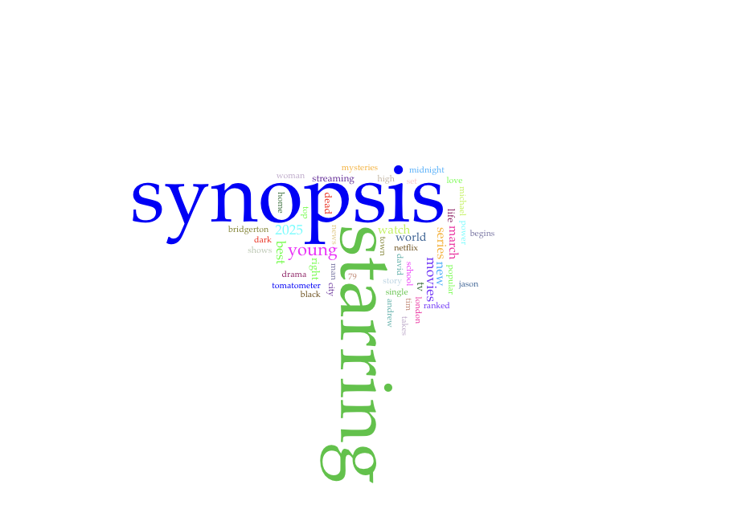



# Distant Reading Assignment 

I used Voyant to search this website! [Best Netflix Series Website](https://editorial.rottentomatoes.com/guide/best-netflix-shows-and-movies-to-binge-watch-now/)

Image from Voyant:

This file ends in ".md," which means it is a Markdown document, rather than HTML. I find Markdown easier to use than HTML, but you can easily change this to an HTML document if you prefer: just replace the .md with .html and commit! 

Here is a fun link to a [Markdown Cheatsheet](https://www.markdownguide.org/cheat-sheet/). Once you grasp the basics here, go add "Markdown" to your list of skills on your resume!
